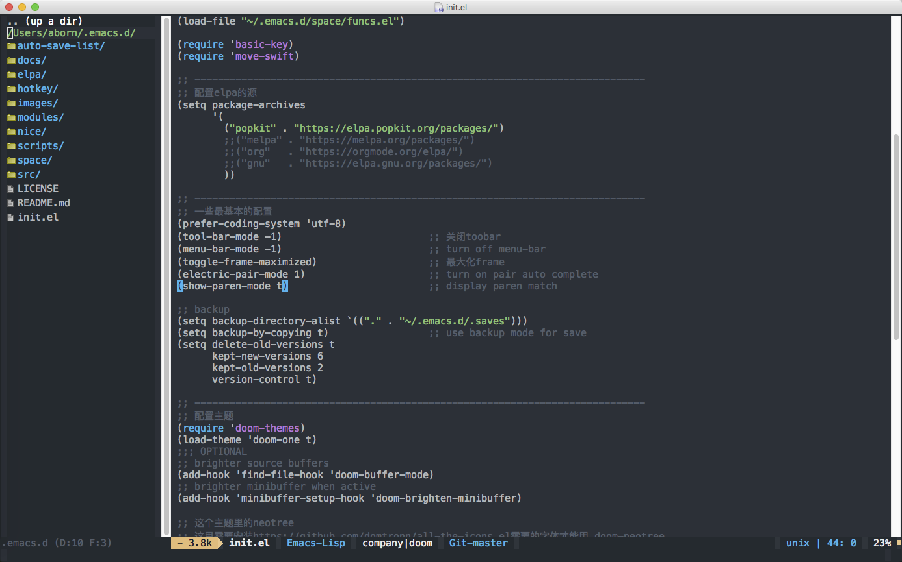

# nicemacs
A simple, stable and efficient emacs configuration!  

## emacs 
24.5+

## Who can benefit from nicemacs?
1. emacs newbie  
2. elpa package release, keep stable, without elpa dependency  
3. keep simple, install from one command line.  

## Installation
For unix-like system (mac & linux), open terminal, execute following command  
```shell
$ sh -c "$(curl -fsSL https://raw.github.com/aborn/nicemacs/master/scripts/install.sh)"
```
For windows user, use git clone this project as .emacs.d

English version readme ends here. Chinese readme provided as follows.

--------------------------------------------------------------------------------

# nicemacs
Yeah, nice emacs, 不折腾！！

## emacs版本
在emacs 24.5+ 上测试通过

## 为什么?
1. 为emacs新用户提供最基础的发行版本配置
2. 不折腾，一键下载安装，不需要对任何elpa的依赖
3. 保持稳定性，用着安心，不会出现诡异问题

## 一键安装
在命令行下执行以下命令进行安装：

```shell
$ sh -c "$(curl -fsSL https://raw.github.com/aborn/nicemacs/master/scripts/install.sh)"
```

## 使用注意
1. emacs新用户，这些用户可以基于这个最基本配置进行添加自己的配置，即使不添加自己的配置也能使用
2. 不适合emacs老手

## Screenshots
mac osx  


